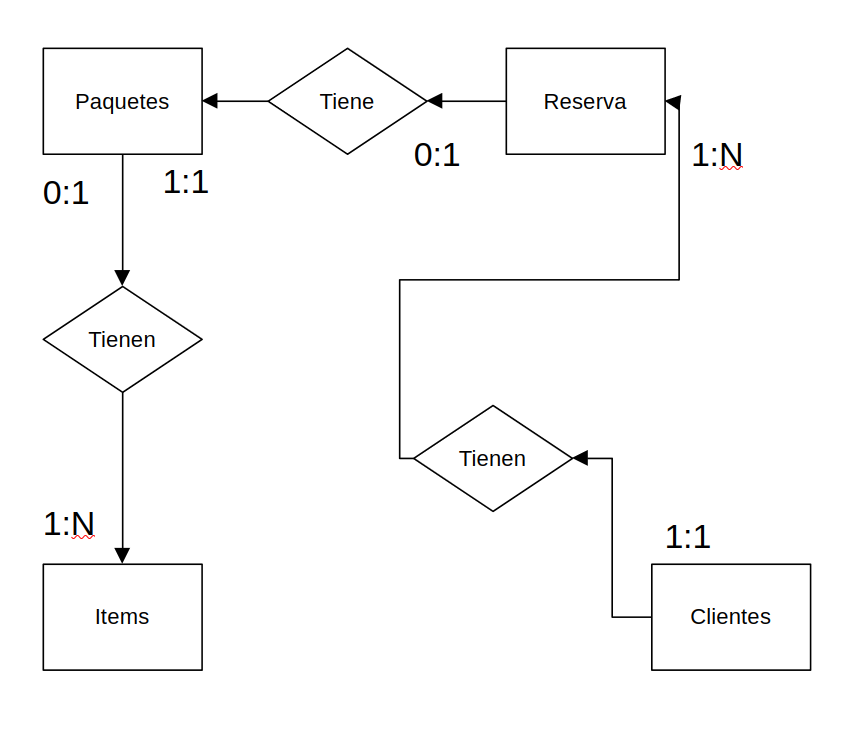
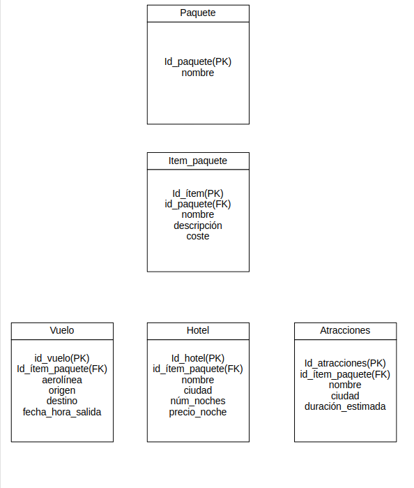

# Ejercicio práctico 004 · Agencia de viajes local


## Fase 1: Análisis y Casos de Uso

Primero apuntaremos las entidades que han sido identificadas:

`Paquete turistico` 
Es el producto principal de la agencia. Un paquete está compuesto por varios ítems.

`Item de paquete` 
Elementos individuales que conforman un paquete:

>1-`Vuelo`
con atributos como ciudad de origen, destino, aerolínea, fecha y hora.

>2-`Hotel`
con nombre, ciudad, número de noches y precio por noche.

>3-`Atraccion`
con duracion estimada y ciudad.

`Cliente`
La persona que realiza una reserva.

`Reserva`
La venta de un paquete a un cliente, que puede ser para varias personas.

### Casos de uso (Funcionalidades):

`Gestión de Paquetes:`

>Crear un nuevo paquete y añadir, modificar o eliminar ítems de forma ordenada.
 Duplicar un paquete base para modificarlo.
Actualizar automáticamente el coste total de un paquete cuando se añaden o eliminan ítems.


`Gestión de Reservas y Clientes:`

>Registrar una reserva de un paquete para un cliente, especificando el número de personas.
Consultar el historial de reservas de un cliente.
Identificar a los "mejores clientes" por facturación o número de viajes.


`Análisis e Informes:`

>Calcular cuántas personas han viajado con cada paquete.
Calcular el dinero generado por cada cliente.
Ver qué paquetes son los más vendidos en cada temporada.
Identificar paquetes que nunca se han reservado.
Analizar la popularidad de destinos por país o ciudad.

## Fase 2: Diagrama Entidad-Relacion



## Fase 3: Diagrama normalizado



## Fase 4: Creación de tablas

```sql
-- Creación de la tabla principal de paquetes
CREATE TABLE paquetes (
    paquete_id SERIAL PRIMARY KEY,
    nombre_paquete VARCHAR(255) NOT NULL,
    coste_total NUMERIC(10, 2) DEFAULT 0.00
);

-- Creación de la tabla padre para los ítems
CREATE TABLE items_paquete (
    item_id SERIAL PRIMARY KEY,
    paquete_id INT NOT NULL REFERENCES paquetes(paquete_id) ON DELETE CASCADE ON UPDATE CASCADE,
    descripcion TEXT,
    coste NUMERIC(10, 2) NOT NULL,
    orden INT NOT NULL,
    fecha DATE NOT NULL,
    CONSTRAINT chk_orden CHECK (orden > 0)
);

-- Creación de tablas hijas con herencia
CREATE TABLE vuelos (
    aerolinea VARCHAR(100),
    origen VARCHAR(100),
    destino VARCHAR(100)
) INHERITS (items_paquete);

CREATE TABLE hoteles (
    nombre_hotel VARCHAR(255),
    ciudad VARCHAR(100),
    num_noches INT,
    precio_por_noche NUMERIC(10, 2)
) INHERITS (items_paquete);

CREATE TABLE atracciones (
    nombre_atraccion VARCHAR(255),
    ciudad VARCHAR(100),
    duracion_estimada_min INT
) INHERITS (items_paquete);

-- Creación de las tablas de Clientes y Reservas
CREATE TABLE clientes (
    cliente_id SERIAL PRIMARY KEY,
    nombre VARCHAR(255) NOT NULL,
    email VARCHAR(255) UNIQUE
);

CREATE TABLE reservas (
    reserva_id SERIAL PRIMARY KEY,
    paquete_id INT NOT NULL REFERENCES paquetes(paquete_id) ON DELETE RESTRICT,
    cliente_id INT NOT NULL REFERENCES clientes(cliente_id) ON DELETE RESTRICT,
    fecha_reserva DATE NOT NULL DEFAULT CURRENT_DATE,
    num_personas INT NOT NULL,
    coste_reserva NUMERIC(10, 2) NOT NULL,
    CONSTRAINT chk_personas CHECK (num_personas > 0)
);
```
QUITAR ESTO DESPUES DE HABLAR CON JUANMA
>Comentarios de diseño:

>INHERITS -> La necesidad de que al consultar que contiene un item de un paquete tener toda las informacion sin nesecidad de llamar a las demas tablas.

>En la tabla reservas  ON DELETE RESTRICT -> Esta desición se toma pensando en la sostenibilidad de la base de datos en un futuro y se tenga un registro de las reservas realizadas aunque los papuetes y/o los clientes ya no existan.

>El check de la fecha de la reserva se hace con la fecha actual por que se entiende que se introduzen los datos de la reserva justo al realizarla de no ser asi se han de introducir los datos pertinentes.

### 📝 Comentarios de Diseño y Justificación Técnica

---

### **Herencia con `INHERITS`**

La elección de utilizar `INHERITS` para la relación entre `items_paquete` y sus tablas hijas (`vuelos`, `hoteles`, `atracciones`) es una decisión de diseño fundamental en PostgreSQL que modela la jerarquía de los elementos que componen un paquete. Esta aproximación ofrece varias ventajas clave:

* **Consultas Simplificadas**: Permite la consulta de todos los ítems de un paquete de forma transparente y eficiente, sin necesidad de realizar `JOIN`s complejos. Una simple `SELECT *` a la tabla padre `items_paquete` devolverá automáticamente todos los registros de las tablas hijas, consolidando el itinerario completo del paquete.
* **Organización Lógica**: Se alinea perfectamente con el concepto de que un `vuelo` o un `hotel` **es un** `item_paquete`, permitiendo que las tablas hijas hereden los atributos comunes (como `coste` y `descripcion`) y añadan sus campos específicos.
* **Flexibilidad y Mantenimiento**: Facilita la futura expansión del modelo. Si la agencia decide añadir un nuevo tipo de ítem, como el alquiler de coches, solo se necesitaría crear una nueva tabla que herede de `items_paquete`, manteniendo el esquema organizado y escalable.

---

### **Clave Foránea con `ON DELETE RESTRICT`**

La restricción `ON DELETE RESTRICT` en las claves foráneas de la tabla `reservas` es una medida crucial para asegurar la **integridad referencial** y la **sostenibilidad de los datos** a largo plazo.

* **Protección de Datos Históricos**: Esta restricción previene la eliminación de un `paquete` o un `cliente` si existen `reservas` asociadas. Las reservas son registros de ventas vitales para el análisis de ingresos, la popularidad de los paquetes y el historial de los clientes, por lo que su protección es una prioridad.
* **Evita Registros Huérfanos**: Garantiza que ninguna reserva pueda quedar sin un `paquete_id` o `cliente_id` de referencia, lo que resultaría en una base de datos inconsistente y con información sin sentido.
* **Flujo de Trabajo Controlado**: Obliga a un proceso de eliminación consciente y manual. Para borrar un paquete, primero se deben eliminar todas sus reservas asociadas, lo que sirve como una medida de seguridad para evitar la pérdida accidental de información.

---

### **Restricción de Fecha en `RESERVAS`**

La decisión de usar `DEFAULT CURRENT_DATE` para la columna `fecha_reserva` se basa en la suposición de que el registro de una reserva se realiza en el mismo momento en que se efectúa la compra.

* **Automatización**: Esta configuración simplifica el proceso de inserción de datos, ya que el sistema asigna la fecha actual automáticamente, minimizando los errores de entrada manual y agilizando la gestión de reservas.
* **Simplicidad y Adaptabilidad**: Proporciona un punto de partida práctico. Si en el futuro se necesitara una validación más estricta, como asegurar que las fechas no sean del pasado o de un futuro lejano, se podría complementar fácilmente con una restricción `CHECK` adicional.