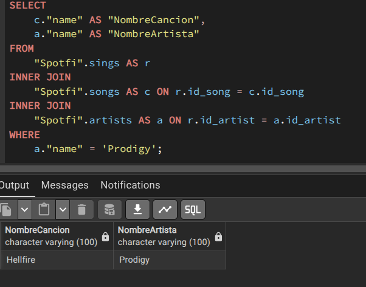
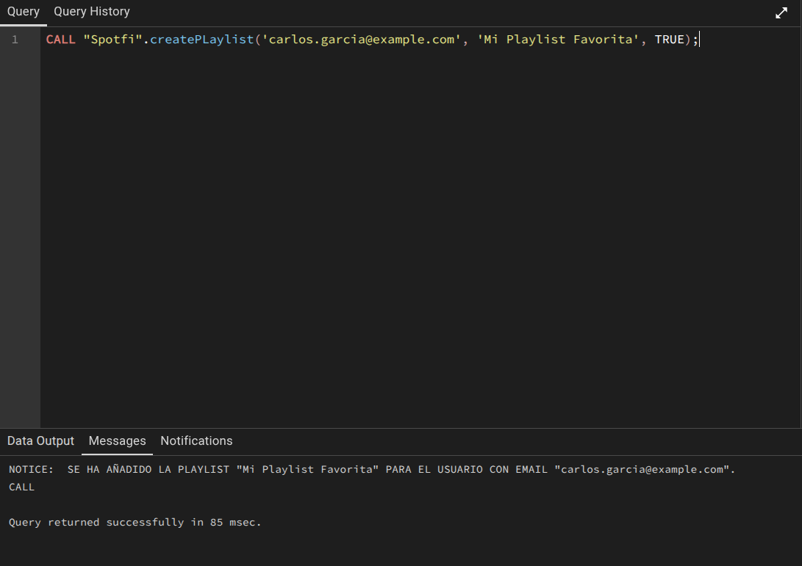
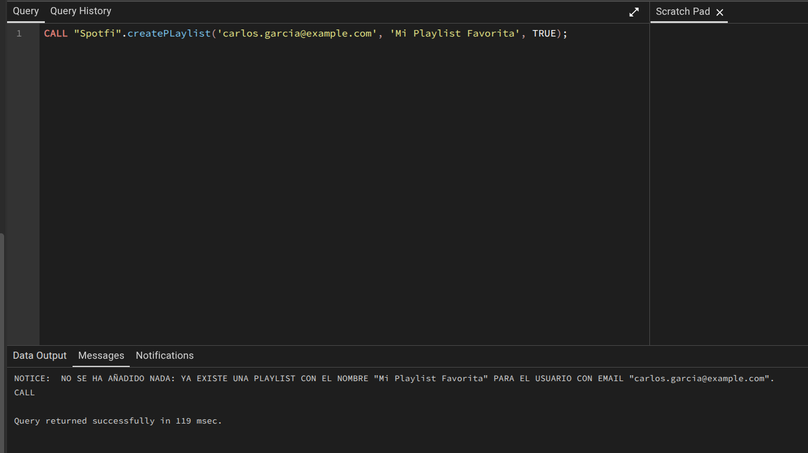

# Parte 2 UF2176 PLSQL

### Procedimiento para insertar un artista y una cancion

> La idea es
> Create procedure ...
> 
> BEGIN
> 
> 1 comprobar si existe
> 
> si no crearlo (insert into)
> 
> 2 recuperar el id artista
> 
> Lo mismos pasos  con la cancion
> 
> y registrar la relacion en sings
>

`Raise notice` para generar un mensaje por consola.

`variable empleado.Puesto%TYPE`

Variable es el nombre de la variable y lo siguiente es que la variable sea del mismo tipo de empleado.Puesto ejemplo si fuese un entero pues guardaria un entero para cuando no sabemos que tipo es la variable.

La solución a crear un procedimiento que añada artista y cancion.

> Importante la clausula EXISTS antes de la consulta te devuelve verdadero o false segun si existe datos de la consulta.

```plsql
CREATE OR REPLACE PROCEDURE "Spotfi".añadirArtistaCancion(artista VARCHAR(50), cancion VARCHAR(50))
AS $$
DECLARE
    id_art INT;
    id_son INT;
BEGIN
    -- CREAR EL ARTISTA SI NO EXISTE
    IF NOT EXISTS(SELECT 1 FROM "Spotfi".artists WHERE "name" = artista) THEN
        INSERT INTO "Spotfi".artists("name") VALUES (artista);
    END IF;

    -- CREAR LA CANCION SI NO EXISTE
    IF NOT EXISTS(SELECT 1 FROM "Spotfi".songs WHERE "name" = cancion) THEN
        INSERT INTO "Spotfi".songs("name") VALUES (cancion);
    END IF;

    -- OBTENER ID ARTISTA
    SELECT id_artist INTO id_art FROM "Spotfi".artists WHERE "name" = artista;

    -- OBTENER ID CANCION
    SELECT id_song INTO id_son FROM "Spotfi".songs WHERE "name" = cancion;

    -- CREAR LA RELACION SI NO EXISTE
    IF NOT EXISTS(SELECT 1 FROM "Spotfi".sings WHERE id_artist = id_art AND id_song = id_son) THEN
        INSERT INTO "Spotfi".sings(id_artist, id_song) VALUES (id_art, id_son);
    END IF;
END;
$$ LANGUAGE plpgsql;

```


Y para llamar al procedimiento primero debemos crearlo y luego llamarlo.

Llamada = 

```plsql
CALL "Spotfi".añadirArtistaCancion('Prodigy', 'Hellfire');
```
El ejemplo usado con artista y cancion luego se comprueba que funciona.

A continuación se muestra que el procedimiento funcionó.



Pongo aqui el codigo de despues.

```sql
CALL "Spotfi".añadirArtistaCancion('Prodigy', 'Hellfire');
CALL "Spotfi".añadirArtistaCancion('Prodigy', 'FireStarter');
SELECT
    c."name" AS "NombreCancion",
    a."name" AS "NombreArtista"
FROM
    "Spotfi".sings AS r
INNER JOIN
    "Spotfi".songs AS c ON r.id_song = c.id_song
INNER JOIN
    "Spotfi".artists AS a ON r.id_artist = a.id_artist
WHERE
    a."name" = 'Prodigy';
```
#### Enunciado
Crear un procedimiento createPlaylist(email TEXT,plName TEXT) que:
Dado un email y un nombre de Playlist
Cree una Playlist con ese nombre para el usuario que tiene ese email
siempre y cuando no exista ya una Playlist con ese nombre para ese usuario
y el usuario ya exista.
NO SE DA DE ALTA AL USUARIO.

```sql
CREATE OR REPLACE PROCEDURE "Spotfi".createPLaylist(IN email TEXT, plName TEXT, pPublic BOOL)
AS $$
DECLARE
    id_usuario INT;
    id_nuevaPlayList INT;
BEGIN
    -- VERIFICAMOS SI EXISTE UNA PLAYLIST CON EL USUARIO CON ESE EMAIL
    IF NOT EXISTS (
        SELECT 1
        FROM "Spotfi".users AS s
        INNER JOIN "Spotfi".playlist_user AS plu ON s.id_user = plu.id_user
        INNER JOIN "Spotfi".playlists AS pl ON plu.id_playlist = pl.id_playlist
        WHERE s."email" = createPLaylist.email AND pl."name" = plName
    ) THEN
        -- OBTENEMOS EL ID DEL USUARIO CON EL EMAIL PROPORCIONADO
        SELECT u.id_user INTO id_usuario
        FROM "Spotfi".users AS u
        WHERE u."email" = createPLaylist.email;

        -- SI EL USUARIO NO EXISTE, SALIMOS
        IF id_usuario IS NULL THEN
            RAISE NOTICE 'El usuario con email "%" no existe.', createPLaylist.email;
            RETURN;
        END IF;

        -- CREAMOS LA PLAYLIST
        INSERT INTO "Spotfi".playlists("name", public) VALUES (plName, pPublic);

        -- OBTENEMOS EL ID DE LA PLAYLIST RECIÉN CREADA
        SELECT p.id_playlist INTO id_nuevaPlayList
        FROM "Spotfi".playlists AS p
        WHERE p."name" = plName;

        -- ASOCIAMOS LA PLAYLIST AL USUARIO
        INSERT INTO "Spotfi".playlist_user(id_playlist, id_user) VALUES (id_nuevaPlayList, id_usuario);

        RAISE NOTICE 'SE HA AÑADIDO LA PLAYLIST "%" PARA EL USUARIO CON EMAIL "%".', plName, createPLaylist.email;
    ELSE
        RAISE NOTICE 'NO SE HA AÑADIDO NADA: YA EXISTE UNA PLAYLIST CON EL NOMBRE "%" PARA EL USUARIO CON EMAIL "%".', plName, createPLaylist.email;
    END IF;
END;
$$ LANGUAGE plpgsql;
```

