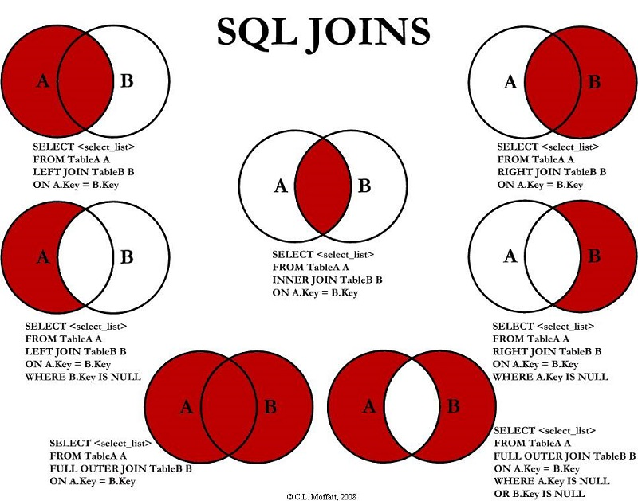

# UF2176


## Comienzo 


El siguiente codigo es el codigo que te da pgadmin cuando hacemos create base.


```SQL
CREATE DATABASE "Videoclub"
    WITH
    OWNER = postgres
    ENCODING = 'UTF8'
    LOCALE_PROVIDER = 'libc'
    CONNECTION LIMIT = -1
    IS_TEMPLATE = False;
```

Un schema es una agrupación lógica en mi base de datos.

"Si tengo un area de recursos humanos creo un schema de recursos humanos"

```SQL
CREATE SCHEMA vc
    AUTHORIZATION postgres;

COMMENT ON SCHEMA vc
    IS 'esquema para los objetos del videoclub';
```

# Esquema en pgAdmin

En el contexto de pgAdmin, un **esquema** (o *schema* en inglés) es un contenedor lógico que se utiliza para organizar objetos dentro de una base de datos PostgreSQL. Los objetos que pueden ser organizados mediante esquemas incluyen tablas, vistas, índices, funciones, entre otros.

## Usos de los Esquemas

1. **Organización**:
   - Permite mantener los objetos de la base de datos organizados y separados lógicamente.
   - Ejemplo: Esquemas separados para datos de recursos humanos y datos financieros.

2. **Control de Acceso**:
   - Los permisos pueden ser asignados a nivel de esquema, facilitando la gestión de acceso a los objetos de la base de datos.

3. **Evitar Conflictos de Nombres**:
   - Diferentes esquemas pueden tener tablas o funciones con el mismo nombre sin causar conflictos.

4. **Modularidad**:
   - Facilita la gestión de bases de datos grandes y complejas al dividirlas en módulos más pequeños y manejables.

## Gestión de Esquemas en pgAdmin

En pgAdmin, puedes realizar las siguientes acciones con esquemas utilizando su interfaz gráfica de usuario:

- Crear nuevos esquemas.
- Modificar esquemas existentes.
- Eliminar esquemas.

Esto facilita la administración y organización de la estructura de tu base de datos PostgreSQL.


Arriba a la derecha query tool para poder escribir para crear tablas hacer consultas ect se conecta a posgres que es la base de datos o server que hemos definido en linux.

## Creacion de tablas a partir de diagrama Relacional

![El Diagrama es este][def]

### Creación de la primera tabla

```SQL
CREATE TABLE IF NOT EXISTS vc.peliculas
(
cpelicula		NUMERIC(10,0),
titulo			VARCHAR(150) CONSTRAINT titulo_nn 		NOT NULL,
genero			VARCHAR(25)  CONSTRAINT genero_nn 		NOT NULL,
duracion		SMALLINT     CONSTRAINT duracion_nn 	NOT NULL,
anyo			NUMERIC(4,0) CONSTRAINT ano_nn			NOT NULL,

-- Ahora las constraint

CONSTRAINT peliculas_pk 	PRIMARY KEY		(cpelicula),
CONSTRAINT titulo_uq		UNIQUE			(titulo),
CONSTRAINT genero_ck		CHECK			(genero IN ('Drama',
													   'Comedia',
													  'Accion',
													  'Terror',
													  'Indefinido')),
CONSTRAINT duracion_ck		CHECK			(duracion < 300 AND duracion > 0),
CONSTRAINT anyo_ck				CHECK		(anyo >= 1895)

													

);
```

### Creación de la segunda tabla

```SQL
CREATE TABLE IF NOT EXISTS vc.protagonistas
(
	cprotagonista 	SMALLSERIAL,
	nombre			VARCHAR(150) CONSTRAINT nombre_nn 			NOT NULL,
	nacionalidad 	VARCHAR(25),


	CONSTRAINT protagonista_pk	PRIMARY KEY(cprotagonista)
);
```

### Creación de tercera tabla

```SQL
CREATE TABLE IF NOT EXISTS vc.peliprota
(
	cpelicula		NUMERIC(10,0),
	cprotagonista	SMALLINT,

	-- AQUI EN LUGAR DE UN SMALLSERIAL SE LE PONE SMALLINT 
	-- COMO VIENE DE LA OTRA TABLA ES LA QUE LO GENERARA

	CONSTRAINT peliprota_pk									PRIMARY KEY (cpelicula,cprotagonista),
	--BLOQUE FOREIGN KEY 1
	CONSTRAINT peliprota_pelicula_fk     
	FOREIGN KEY  (cpelicula)	  REFERENCES vc.peliculas(cpelicula) 
	ON DELETE CASCADE 
	ON UPDATE CASCADE,
	--FIN BLOQUE FOREIGN KEY 1 
	CONSTRAINT peliprota_protagonista_fk 
	FOREIGN KEY  (cprotagonista) REFERENCES vc.protagonistas(cprotagonista)
	ON DELETE RESTRICT 
	ON UPDATE CASCADE
);
```
### Cuarta tabla

```SQL
CREATE TABLE IF NOT EXISTS vc.copias
(
 ncopia     	SMALLSERIAL,
 cpelicula  	SMALLINT CONSTRAINT cpelicula_nn NOT NULL,
 alquilada  	BOOLEAN,
 conservacion	CHAR(1),

 CONSTRAINT ncopia_ck 		PRIMARY KEY (ncopia),
 --1 FK
 CONSTRAINT cpelicula_fk	FOREIGN KEY (cpelicula) 	
 REFERENCES vc.peliculas(cpelicula)
 ON DELETE CASCADE
 ON UPDATE CASCADE,
 --1FK
 CONSTRAINT conservacion_ck CHECK (conservacion IN('B',
 												   'R',
													'M'))
);
```

### Quinta tabla

```SQL
CREATE TABLE IF NOT EXISTS vc.socios
(
 dni 		CHAR(9),
 telefono	CHAR(9),
 email		VARCHAR(50),
 nombre		VARCHAR(50) CONSTRAINT nombre_nn		NOT NULL,
 apellidos	VARCHAR(50) CONSTRAINT apellidos_nn	NOT NULL,
 direccion	VARCHAR(150),
 fechanac	DATE		 CONSTRAINT fechanac_nn		NOT NULL,
 -- dni aval?
 CONSTRAINT dni_pk PRIMARY KEY (dni)
);

```
dni aval es algo que no entendi muy bien en su momento la relación.

### Sexta tabla

```SQL
CREATE TABLE IF NOT EXISTS vc.multas
(
 nmulta 	SMALLSERIAL,
 dni		VARCHAR(9) 		CONSTRAINT dni_nn 		NOT NULL,
 causa		VARCHAR(50)		CONSTRAINT causa_nn 	NOT NULL,
 sancion	VARCHAR(50)		CONSTRAINT sancion_nn	NOT NULL,
 ncopia		SMALLINT		CONSTRAINT ncopia		NOT NULL,


 CONSTRAINT nmulta_pk	PRIMARY KEY (nmulta),
 CONSTRAINT dni_fk		
 FOREIGN KEY (dni) REFERENCES vc.socios(dni)
 ON DELETE CASCADE 
 ON UPDATE CASCADE,
 CONSTRAINT ncopia_fk 
 FOREIGN KEY (ncopia)
 REFERENCES  vc.copias(ncopia)
 ON DELETE CASCADE
 ON UPDATE CASCADE
);
```
### Septima tabla

```SQL
CREATE TABLE IF NOT EXISTS vc.alquila
(
 ncopia SMALLINT,
 dni    CHAR(9),
 falq   DATE,
 fdev   DATE CONSTRAINT fdev_nn NOT NULL,

 CONSTRAINT alquila_pk PRIMARY KEY (ncopia, dni, falq),

 CONSTRAINT alquila_ncopia_fk FOREIGN KEY (ncopia)
        REFERENCES vc.copias(ncopia)
        ON DELETE CASCADE
        ON UPDATE CASCADE,

 CONSTRAINT alquila_dni_fk FOREIGN KEY (dni)
        REFERENCES vc.socios(dni)
        ON DELETE CASCADE
        ON UPDATE CASCADE,

 CONSTRAINT fdev_ck CHECK (fdev >= falq + INTERVAL '3 days')
 
);
```


### Base de datos ejemplo para incluir
https://github.com/morenoh149/postgresDBSamples/tree/master/adventureworks

### Para descargar directiorio github
https://download-directory.github.io/


## SELECT

```SQL
SELECT 		* FROM	production.product;
SELECT	productid name, productnumber FROM production.product;
SELECT  productid AS "CLave", name, productnumber FROM production.product;
SELECT   productid AS "CLave", listprice AS "Precio",listprice *0.20 AS "Descuento" FROM production.product;
SELECT   productid AS "CLave", listprice AS "Precio",listprice *0.20 AS "Descuento" FROM production.product ORDER BY "Descuento" DESC;
SELECT   productid AS "CLave", listprice AS "Precio",listprice *0.20 AS "Descuento" FROM production.product ORDER BY "listprice" DESC;
```

```SQL
SELECT   productid AS "CLave", listprice AS "Precio",listprice *0.20 AS "Descuento" FROM production.product ORDER BY 1 DESC, 2 ASC;
```
>EL 1 y el 2 es sobre las columnas que le pasamos en el SELECT no sobre las columnas de la tabla.


```SQL
/*
nombres de los 10 productos mas caros ordenados de mayor a menor precio 
*/

SELECT name AS "NOMBRE", listprice AS "PRECIO"

FROM production.product ORDER BY "PRECIO" DESC LIMIT 10;

/*
NOMBRES DE LOS 15 PRIMEROS PRODUCTOS MAS BARATOS DE MENOR A MAYIOR PRECIO
*/

SELECT name AS "NOMBRE", listprice AS "PRECIO"

FROM production.product WHERE listprice > 0 ORDER BY "PRECIO" ASC   LIMIT 15;

```

> Recordar que dentro del WHERE tiene que ir la columna original y no el alias que le hemos puesto.


>Le hemos dado a File preferencias Query Tools y le hemos puesto el autocompletar.

#### *Enunciado*
Identificar las 50 lineas de pedido de mayor improte teniendo en cuenta el descuento de las lineas cuyo precio unistario esta entre 25 y 50

```SQL
SELECT salesorderid 	  							AS 			"Pedido",
	   salesorderdetailid   						AS 			"Linea",
	   unitprice * (1-unitpricediscount)*orderqty 	AS 			"Importe"
	  

FROM sales.salesorderdetail
WHERE unitprice >= 25 AND 
	  unitprice <= 50
ORDER BY "Importe" DESC
LIMIT 50
```
#### *Enunciado*
Codigos de pedidos y la revision de 
los pedidos en status = 4 (ENTREGADOS)
con el total del pedido, viendo ademas la fecha de pedido 
y la fecha de envio cuyo importe sea mayor de 5000€

```SQL
SELECT 
purchaseorderid   						AS 				"CodigoPedido",
revisionnumber							AS				"RevisionPedido",
(taxamt + subtotal+freight)				AS				"TotalPedido",
orderdate								AS				"FechaPedido",
shipdate								AS				"FechaEnvio"


FROM purchasing.purchaseorderheader
WHERE (taxamt + subtotal+freight) >= 5000 AND status = 4
ORDER BY "TotalPedido" DESC;
```

#### Enunciado


PAra evaluar a mis proovedores
quiero un listado en el que aprezca el id 
del provedor (vendor) y los dias
tardados en enviarme mi pedido


```SQL
SELECT 
    vendorid                          AS ProveedorID,
    (shipdate - orderdate)           AS DiasEnvio,
    purchaseorderid                  AS PedidoID
   
FROM purchasing.purchaseorderheader
WHERE shipdate IS NOT NULL
ORDER BY DiasEnvio ASC;
```

Version con el distinct para ver solo los dias que suelen tardar

```SQL
SELECT DISTINCT
   
    (shipdate - orderdate)           AS DiasEnvio
   
   
FROM purchasing.purchaseorderheader

ORDER BY DiasEnvio ;


```


## Operador LIKE en SQL

El operador `LIKE` en SQL se utiliza en una cláusula `WHERE` para buscar un patrón específico en una columna de una tabla. Es especialmente útil cuando necesitas comparar una parte de una cadena de texto con un patrón.

## Sintaxis

```sql
SELECT column1, column2, ...
FROM table_name
WHERE columnN LIKE pattern;
```

## Comodines

El operador `LIKE` se usa junto con comodines para definir el patrón de búsqueda. Los comodines más comunes son:

- `%`: Representa cero, uno o múltiples caracteres.
- `_`: Representa un solo carácter.

## Ejemplos

### Ejemplo 1: Uso del comodín `%`

| ID | Nombre | Apellido | Departamento |
|----|--------|----------|--------------|
| 1 | Juan | Pérez | Ventas |
| 2 | María | López | TI |
| 3 | Carlos | Martínez | Ventas |
| 4 | Ana | García | RRHH |

```sql
SELECT * FROM Empleados
WHERE Nombre LIKE 'M%';
```

Resultado:

| ID | Nombre | Apellido | Departamento |
|----|--------|----------|--------------|
| 2 | María | López | TI |

### Ejemplo 2: Uso del comodín `_`

```sql
SELECT * FROM Empleados
WHERE Apellido LIKE '_ _ _ z';
```

Resultado:

| ID | Nombre | Apellido | Departamento |
|----|--------|----------|--------------|
| 2 | María | López | TI |

### Ejemplo 3: Combinación de comodines

```sql
SELECT * FROM Empleados
WHERE Departamento LIKE '%a%';
```

Resultado:

| ID | Nombre | Apellido | Departamento |
|----|--------|----------|--------------|
| 1 | Juan | Pérez | Ventas |
| 3 | Carlos | Martínez | Ventas |

## Conclusión

El operador `LIKE` es una herramienta poderosa para realizar búsquedas de patrones en bases de datos SQL. Con los comodines `%` y `_`, puedes crear consultas flexibles para encontrar exactamente lo que necesitas en tus datos.


----------------------------------


### Tipos de JOINs en SQL



#### Descripción de los JOINs:
   Tipo de JOIN         | Descripción                                                                                     | Resultado en el Diagrama                     |
 |----------------------|-------------------------------------------------------------------------------------------------|-----------------------------------------------|
 | **INNER JOIN**       | Solo las filas con coincidencia en ambas tablas.                                               | Solo la intersección de los círculos.         |
 | **LEFT JOIN**        | Todas las filas de la tabla izquierda + las coincidencias de la derecha.                      | Todo el círculo izquierdo + la intersección. |
 | **RIGHT JOIN**       | Todas las filas de la tabla derecha + las coincidencias de la izquierda.                      | Todo el círculo derecho + la intersección.   |
 | **FULL OUTER JOIN**  | Todas las filas de ambas tablas, con `NULL` donde no hay coincidencia.                        | Todo el círculo izquierdo + todo el derecho. |

---

### Explicación Detallada:

1. **INNER JOIN**:
   - Solo devuelve las filas que tienen coincidencia en ambas tablas.
   - En el diagrama: Solo la zona donde se superponen los círculos.

2. **LEFT JOIN**:
   - Devuelve todas las filas de la tabla izquierda, incluso si no hay coincidencia en la tabla derecha.
   - En el diagrama: Todo el círculo izquierdo, incluyendo la intersección.

3. **RIGHT JOIN**:
   - Devuelve todas las filas de la tabla derecha, incluso si no hay coincidencia en la tabla izquierda.
   - En el diagrama: Todo el círculo derecho, incluyendo la intersección.

4. **FULL OUTER JOIN**:
   - Devuelve todas las filas de ambas tablas, con `NULL` en las columnas de la tabla que no tiene coincidencia.
   - En el diagrama: Todo el círculo izquierdo y todo el círculo derecho.

---

### Ejemplo Práctico:

Si tienes dos tablas, `Clientes` y `Pedidos`:

- **INNER JOIN**: Solo los clientes que han realizado pedidos.
- **LEFT JOIN**: Todos los clientes, incluyendo los que no han realizado pedidos (con `NULL` en las columnas de pedidos).
- **RIGHT JOIN**: Todos los pedidos, incluyendo los que no tienen un cliente asociado (poco común en este contexto).
- **FULL OUTER JOIN**: Todos los clientes y todos los pedidos, con `NULL` donde no hay coincidencia.

---


#### Enunciado
Listado de nombre y direccion de correo electronico
de las personas que sean del tipo IN

```SQL
SELECT
    per.firstname         AS Nombre,
    per.lastname          AS Apellido,
    ea.emailaddress       AS Email
FROM person.person AS per
INNER JOIN person.emailaddress AS ea
    ON ea.businessentityid = per.businessentityid
WHERE per.persontype = 'IN';
```


#### Enunciado

Obtener un listado de los nombres  de las categorias y nombres de subgategorias


```SQL
SELECT
	cat.name 		AS NombreCategoria,
	catsub.name		AS NombreSubCategoria

FROM	production.productcategory AS cat
INNER JOIN
		production.productsubcategory AS catsub
ON		cat.productcategoryid = catsub.productcategoryid
ORDER BY NombreCategoria,NombreSubCategoria;
```


#### Enunciado
Listar nombre de los empleados y el codigo de su departamento actual

```SQL
SELECT
    per.firstname                    AS Nombre,
  
    dept.name                       AS NombreDepartamento
FROM person.person AS per
INNER JOIN humanresources.employee AS emp
    ON per.businessentityid = emp.businessentityid
INNER JOIN humanresources.employeedepartmenthistory AS edh
    ON emp.businessentityid = edh.businessentityid
INNER JOIN humanresources.department AS dept
    ON edh.departmentid = dept.departmentid
WHERE edh.enddate IS NULL
ORDER BY dept.name;

```

#### Enunciado
Listar logid,jobtittle de los empleados y el codigo de su departamento actual

```SQL
SELECT
emp.loginid 		AS "Login",
emp.jobtitle		AS "Puesto",
his.departmentid	AS "CodigpDep"

FROM humanresources.employee AS emp
INNER JOIN humanresources.employeedepartmenthistory AS his
ON his.businessentityid = emp.businessentityid
WHERE his.enddate IS NULL
ORDER BY his.departmentid;
```


#### Enunciado
Listar codigo de pedido y su nombre de a forma de envio(purshsing.shipmethod)

```SQL
SELECT
metod."name"  AS "Nombre",
ped.salesorderid AS "Codigo"

FROM purchasing.shipmethod AS metod
INNER JOIN sales.salesorderheader AS ped
ON metod.shipmethodid = ped.shipmethodid

```


#### Enunciado
listar los ID de los produtos en unventario junto
con el nombre de la ubicacion(almacen) en la que estan almacenados
```SQL
SELECT
pro.productid AS "Productos",
pro.quantity  AS "Cantidad",
loc.name	  AS "Nombre Almacen"


FROM production.location AS loc

INNER JOIN production.productinventory AS pro
ON	loc.locationid = pro.locationid
ORDER BY "Productos"

```


#### Enunciado
Categorias subcategorias y productos
```SQL
SELECT
cat.name			AS  "NombreCategoria",
sub.name			AS	"NombreSubCategoria",
pro.name			AS  "NombreProducto"

FROM production.productcategory 			AS cat
INNER JOIN 	production.productsubcategory	AS sub
ON cat.productcategoryid = sub.productcategoryid
INNER JOIN production.product AS pro
ON sub.productsubcategoryid = pro.productsubcategoryid
ORDER BY "NombreProducto";

```


#### Enunciado
/* REPASO

Nombre categoria, subcategoria, producto */


```SQL
SELECT
cat."name" 		AS "NombreCategoria",
sub."name"		AS "SubCategoria",
pro."name"		AS "NombreProducto"


FROM production.productcategory AS cat
INNER JOIN 
production.productsubcategory   AS sub 
ON cat.productcategoryid = sub.productcategoryid
INNER JOIN
production.product AS pro 
ON sub.productsubcategoryid = pro.productsubcategoryid

```
`INNER JOIN` -> Join interno si un producto tuviese categoria pero no subcategoria no saldria en los resultados de salida

| Tipo de Join   | Comportamiento                                                                                     |
|----------------|---------------------------------------------------------------------------------------------------|
| INNER JOIN     | Solo muestra filas con coincidencia en todas las tablas involucradas en el join.                  |
| LEFT JOIN      | Muestra todas las filas de la tabla de la izquierda, incluso si no hay coincidencia en la derecha.|

INNER JOIN es commutativo por que es un producto.

```
Para hacer un buen join:
1º Identificar las tablas que van a intervenir.
2º Identificar tabla padre y tabla hija.
3º Determinar el tipo de join (INNER, LEFT OUTER ,RIGHT OUTER)
4º Escribir el Join

Para hacer un buen join, la receta es:

	1º Identificar las tablas que van a intervenir.
	2º Identificar tabla padre y tabla hija.
	3º Determinar el tipo de join (INNER, LEFT OUTER, RIGHT OUTER)
	4º Escribir el join
		FROM tabla_padre AS alias_padre
				{INNER | LEFT OUTER | RIGHT OUTER} JOIN
			 Tabla_hija  AS alias_hija ON alias_padre.pk_tabla_padre = 
			 							  alias_hija.fk_tabla_hija
	6º aplicar where si es necesario
	7º apliacr order BY

```
#### Enunciado
Clientes y numero de pedido de los clientes incluyendo los que no me han comprado

```SQL

 SELECT *
 FROM
sales.customer AS c
--INNER JOIN
LEFT OUTER JOIN
/*
Si el cliente no tiene pedidos con el left outer join me lo saca igual
*/
sales.salesorderheader AS p
ON
c.customerid = p.customerid
```
¿Como veo los clientes que no tienen pedidos?
Si cambio de orden el join no me saldria nada ya que no hay pedidos sin clientes.

```SQL
 SELECT *
 FROM
sales.customer AS c
--INNER JOIN
LEFT OUTER JOIN
/*
Si el cliente no tiene pedidos con el left outer join me lo saca igual
*/
sales.salesorderheader AS p
ON
c.customerid = p.customerid
WHERE
p.salesorderid IS NULL 
```

#### Enunciado
Nombre de los productos que no se han vendido
```SQL
SELECT
    p."name" AS "NombreProducto"
FROM
    production.product AS p
LEFT  OUTER JOIN
    sales.salesorderdetail AS s
    ON p.productid = s.productid
WHERE
    s.productid IS NULL;

```


#### Enunciado
Nombre de la subcatagorias que no tengan productos
```SQL

SELECT
s."name" AS "Nombre"
FROM
production.productsubcategory AS s
LEFT OUTER JOIN 
production.product AS p
ON
s.productsubcategoryid = p.productsubcategoryid
WHERE
p.productsubcategoryid IS NULL;
```

#### Enunciado

```SQL
SELECT
    p.name AS "NombreProducto"
FROM
    production.product AS p
LEFT OUTER  JOIN
    production.productsubcategory AS sc ON p.productsubcategoryid = sc.productsubcategoryid
WHERE
    sc.productsubcategoryid IS NULL;

```
```SQL
SELECT
    p."name" AS "NombreSubcategoria"
FROM
    production.productsubcategory AS s
RIGHT OUTER JOIN
    production.product AS p
    ON s.productsubcategoryid = p.productsubcategoryid
WHERE
    p.productsubcategoryid IS NULL;


```
```SQL
SELECT
    p."name" AS "NombreProducto"
FROM
    production.product AS p
WHERE
    p.productsubcategoryid IS NULL;

```

#### Enunciado
/*
Subcategorias que no tienen ventas
*/

-- nombre de la subcategoria a la que pertenecen los productos que no tienen ventas

```SQL
SELECT
s."name"    					AS "subcategoria",
p."name"						AS "Producto",
v.salesorderdetailid			AS "Linea",
v.orderqty						AS "Cantidad",
v.unitprice						AS "Precio"

FROM
production.productsubcategory AS s
LEFT OUTER JOIN
production.product AS p
ON s.productsubcategoryid = p.productsubcategoryid
LEFT OUTER JOIN
sales.salesorderdetail AS v
ON
p.productid = v.productid

WHERE v.productid IS NULL
ORDER BY 1,2,3;
```

#### Enunciado
Salespersonid que no han gestionado ningun pedido
```SQL
SELECT
    sp.businessentityid AS  "Persona",
	soh.salesorderid	    AS  "Pedido"
FROM
    sales.salesperson AS sp
LEFT OUTER JOIN
    sales.salesorderheader AS soh ON sp.businessentityid = soh.salespersonid
WHERE
    soh.salesorderid IS NULL;

```

#### Enunciado
Salesorderid de los pedidos que no han sido gestionados por nadie
```SQL
SELECT
    sp.businessentityid AS  "Persona",
	soh.salesorderid	    AS  "Pedido"
FROM
    sales.salesperson AS sp
LEFT OUTER JOIN
    sales.salesorderheader AS soh ON sp.businessentityid = soh.salespersonid
WHERE
    soh.salesorderid IS NULL;

```

Modo de hacerlo con RIGTH OUTER JOIN

```SQL
SELECT *

FROM
sales.salesorderheader AS sh


WHERE sh.salespersonid IS NULL;

SELECT
    sp.businessentityid AS  "Persona",
	soh.salesorderid	    AS  "Pedido"
FROM
    sales.salesperson AS sp
RIGHT OUTER JOIN
    sales.salesorderheader AS soh ON sp.businessentityid = soh.salespersonid
WHERE
    sp.businessentityid IS NULL;

```


#### Enunciado

```SQL

```

### Agrupaciones


#### Enunciado
Numero de empleados por sexo

```SQL
SELECT DISTINCT 
e.gender  				        AS "Genero",
COUNT(e.businessentityid)		AS "Numero"


FROM
humanresources.employee AS e
GROUP BY e.gender;
```
#### Enunciado
Tiempo medio de fabricacion de productos por codigo de subcategoria

```SQL
SELECT
p.productsubcategoryid 				AS "CodSubCat",
ROUND(AVG(daystomanufacture),2)		AS "Tmedio" 

FROM
production.product AS p
WHERE p.productsubcategoryid IS NOT NULL
GROUP BY p.productsubcategoryid -- El alias se puede poner pero solo en posgresql	
ORDER BY "Tmedio" DESC
```
#### Enunciado
Tiempo medio de fabricacion por nombre de la subcategoria
```SQL
SELECT
s."name"							AS "Nombre",
ROUND(AVG(daystomanufacture),2)		AS "Tmedio" 

FROM
production.product AS p
INNER JOIN
production.productsubcategory AS s
ON
p.productsubcategoryid = s.productsubcategoryid

GROUP BY s."name" -- El alias se puede poner pero solo en posgresql	
ORDER BY "Tmedio" DESC
```

#### Enunciado
suma de importe de los pedido por salesterritory name

```SQL
SELECT
t."name"	AS	"NombreTerritorio",
ROUND(SUM(h.totaldue),2) AS "Importe"

FROM
sales.salesterritory  	AS t
INNER JOIN
sales.salesorderheader	AS h
ON
t.territoryid = h.territoryid
GROUP BY t."name"
ORDER BY "Importe" ASC
```

#### Enunciado

```SQL

```

#### Enunciado

```SQL

```

#### Enunciado

```SQL

```

[def]: img/RelacionalToTablas.png