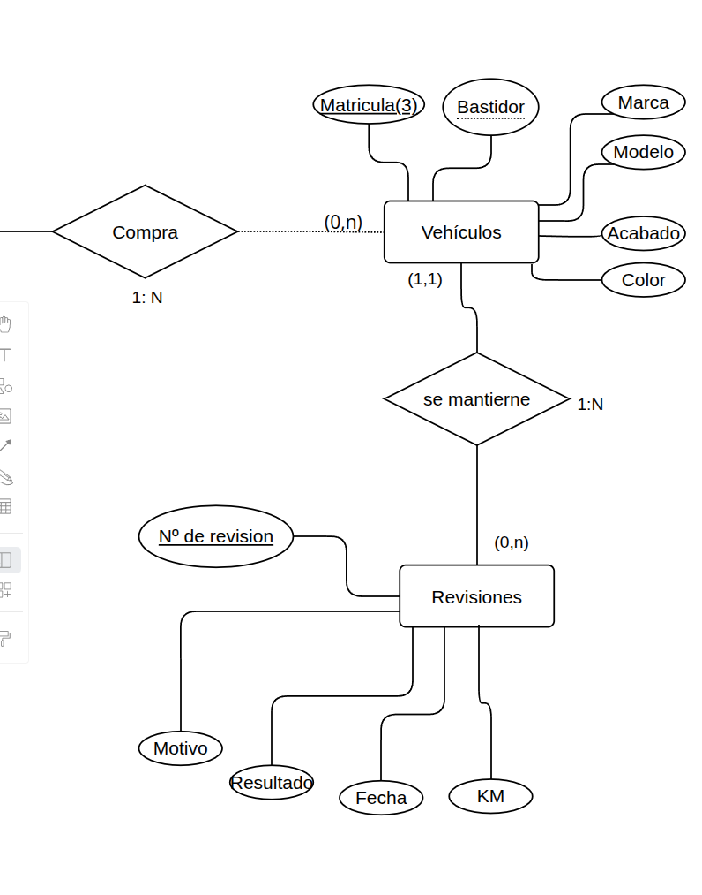
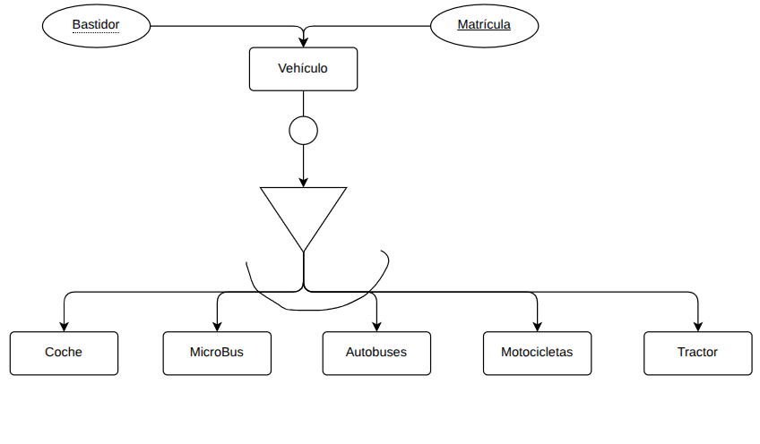

## Apuntes modulo base de datos
https://chat.mistral.ai/
https://pinokio.co/
>Soy el número 4
Contraseña para ebook

AVFDB-QYKWHSAS

Hablamos sobre el modelo de entidad-relación.

> DBA data base administrator. Es el que se encarga de que los datos estan disponibles.

Nosotros nos centramos en como obtener y como se ven los datos donde y como se guardan los datos es asunto del DBA.

> Diagrama entidad relacion shen.

`DDL`  Data Definition language.

`DML`  Data Manipulation language.

`SQL`  Es un lenguaje de especificación.

El rendimiento/desempeño de la basde de datos depende del DBA.

https://online.visual-paradigm.com/es/

# Tipos de Relaciones

## Relaciones Binarias (Grado 2)
Las relaciones binarias involucran a dos entidades.

**Ejemplo:**
- **Entidades:** Estudiante, Curso
- **Relación:** Matriculado_en
- **Descripción:** Un estudiante está matriculado en un curso. Esta relación conecta a un estudiante con un curso específico.

| Estudiante | Matriculado_en | Curso |
|------------|----------------|-------|
| Juan Pérez | Sí | Matemáticas |
| Ana Gómez | Sí | Historia |

## Relaciones Reflexivas (Grado 1)
Las relaciones reflexivas involucran a una sola entidad, donde un elemento está relacionado consigo mismo.

**Ejemplo:**
- **Entidad:** Empleado
- **Relación:** Supervisa_a
- **Descripción:** Un empleado puede supervisar a otro empleado, incluyendo la posibilidad de auto-supervisión en ciertos contextos.

| Empleado | Supervisa_a |
|----------|-------------|
| Carlos López | Carlos López |
| Luis Martínez | Ana Sánchez |

## Relaciones Ternarias
Las relaciones ternarias involucran a tres entidades.

**Ejemplo:**
- **Entidades:** Médico, Paciente, Medicamento
- **Relación:** Prescribe
- **Descripción:** Un médico prescribe un medicamento a un paciente. Esta relación conecta a las tres entidades simultáneamente.

| Médico | Paciente | Prescribe | Medicamento |
|--------|----------|-----------|-------------|
| Dr. García | María Fernández | Sí | Ibuprofeno |
| Dra. Martínez | Pedro Ramírez | Sí | Amoxicilina |

# Relaciones en SQL

En SQL, una relación se refiere a una tabla que está compuesta por filas y columnas. Cada tabla representa una entidad o asociación entre entidades y tiene varios componentes clave:

## Nombre
- **Descripción:** Cada relación (tabla) en una base de datos tiene un nombre único que la identifica.
- **Ejemplo:** Una tabla que almacena información sobre estudiantes podría llamarse `Estudiantes`.

## Grado
- **Descripción:** El grado de una relación se refiere al número de atributos (columnas) que tiene la tabla.
- **Ejemplo:** Si la tabla `Estudiantes` tiene las columnas `ID`, `Nombre`, `Apellido` y `FechaNacimiento`, entonces el grado de la relación es 4.

| ID | Nombre | Apellido | FechaNacimiento |
|----|--------|----------|-----------------|
| 1 | Juan | Pérez | 2000-01-15 |
| 2 | Ana | Gómez | 1999-05-22 |

## Rol
- **Descripción:** El rol se refiere a la función que cumple un atributo dentro de una relación. Esto es especialmente relevante en el contexto de las relaciones entre tablas, como las claves primarias y foráneas.
  - **Clave Primaria:** Un atributo (o conjunto de atributos) que identifica de manera única cada fila en una tabla.
  - **Clave Foránea:** Un atributo que establece una relación entre dos tablas al hacer referencia a la clave primaria de otra tabla.
- **Ejemplo:** En la tabla `Estudiantes`, `ID` podría ser la clave primaria. Si hay otra tabla llamada `Matrículas` que registra qué estudiantes están matriculados en qué cursos, `ID` en `Matrículas` sería una clave foránea que referencia a `Estudiantes`.

**Tabla Matrículas:**

| ID | ID_Estudiante | ID_Curso | FechaMatriculación |
|----|---------------|----------|--------------------|
| 1 | 1 | 101 | 2023-09-01 |
| 2 | 2 | 102 | 2023-09-02 |

En este ejemplo, `ID_Estudiante` en la tabla `Matrículas` es una clave foránea que referencia a la clave primaria `ID` en la tabla `Estudiantes`.

## Tipo de Correspondencia
- **Descripción:** Indica cómo se relacionan las filas de una tabla con las filas de otra tabla. Los tipos de correspondencia más comunes son:

  - **Uno a Uno (1:1):** Una fila en una tabla está relacionada con exactamente una fila en otra tabla.
    - **Ejemplo:** Un empleado tiene un solo registro de detalles de contacto.

  - **Uno a Muchos (1:N):** Una fila en una tabla puede estar relacionada con una o más filas en otra tabla.
    - **Ejemplo:** Un cliente puede tener muchas órdenes de compra.

  - **Muchos a Muchos (M:N):** Muchas filas en una tabla pueden estar relacionadas con muchas filas en otra tabla. Esto generalmente se implementa mediante una tabla intermedia.
    - **Ejemplo:** Los estudiantes pueden inscribirse en muchos cursos, y cada curso puede tener muchos estudiantes. Esto se gestiona a través de una tabla intermedia como `Matrículas`.

- **Ejemplo de Muchos a Muchos:**

**Tabla Cursos:**
 | ID_Curso | Nombre_Curso |
 |----------|--------------|
 | 101 | Matemáticas |
 | 102 | Historia |

**Tabla Matrículas (Tabla intermedia):**
 | ID_Estudiante | ID_Curso |
 |---------------|----------|
 | 1 | 101 |
 | 1 | 102 |
 | 2 | 101 |

 # Propiedades Identificatorias en Bases de Datos

Las propiedades identificatorias son atributos que permiten identificar de manera única las filas en una tabla de una base de datos. Estas propiedades son fundamentales para el diseño y la gestión de bases de datos relacionales.

## Clave Primaria (Primary Key)
- **Descripción:** Una clave primaria es un atributo o conjunto de atributos que identifican de manera única cada fila en una tabla. No puede haber dos filas con la misma clave primaria, y esta no puede contener valores nulos.
- **Ejemplo:** En una tabla `Estudiantes`, el atributo `ID_Estudiante` puede servir como clave primaria.

| ID_Estudiante | Nombre | Apellido |
|---------------|--------|----------|
| 1 | Juan | Pérez |
| 2 | Ana | Gómez |

## Clave Candidata (Candidate Key)
- **Descripción:** Una clave candidata es un atributo o conjunto de atributos que podría servir como clave primaria. Una tabla puede tener múltiples claves candidatas, pero solo una puede ser seleccionada como clave primaria.
- **Ejemplo:** En una tabla `Empleados`, tanto `ID_Empleado` como `CorreoElectrónico` podrían ser claves candidatas si ambos son únicos para cada empleado.

| ID_Empleado | CorreoElectrónico | Nombre |
|-------------|-------------------|--------|
| 101 | juan.perez@empresa.com | Juan |
| 102 | ana.gomez@empresa.com | Ana |

## Clave Alternativa (Alternate Key)
- **Descripción:** Una clave alternativa es una clave candidata que no ha sido seleccionada como clave primaria. Estas claves también garantizan la unicidad de las filas en una tabla.
- **Ejemplo:** Si `ID_Empleado` es la clave primaria en la tabla `Empleados`, entonces `CorreoElectrónico` podría ser una clave alternativa.

## Clave Foránea (Foreign Key)
- **Descripción:** Una clave foránea es un atributo o conjunto de atributos en una tabla que hace referencia a la clave primaria de otra tabla. Las claves foráneas se utilizan para establecer relaciones entre tablas.
- **Ejemplo:** En una tabla `Matrículas`, el atributo `ID_Estudiante` puede ser una clave foránea que referencia a la clave primaria `ID_Estudiante` en la tabla `Estudiantes`.

**Tabla Matrículas:**

| ID_Matrícula | ID_Estudiante | ID_Curso |
|--------------|---------------|----------|
| 1 | 1 | 101 |
| 2 | 2 | 102 |

## Clave Compuesta (Composite Key)
- **Descripción:** Una clave compuesta es una clave primaria que consta de dos o más atributos que, en combinación, identifican de manera única cada fila en una tabla.
- **Ejemplo:** En una tabla `Inscripciones`, la combinación de `ID_Estudiante` y `ID_Curso` podría formar una clave compuesta, ya que un estudiante puede inscribirse en múltiples cursos y un curso puede tener múltiples estudiantes.

**Tabla Inscripciones:**

| ID_Estudiante | ID_Curso | FechaInscripción |
|---------------|----------|------------------|
| 1 | 101 | 2023-09-01 |
| 1 | 102 | 2023-09-02 |
| 2 | 101 | 2023-09-01 |

# Diagrama de Relaciones: Vehículos y Revisiones

## Descripción del Diagrama

El diagrama muestra las relaciones entre varias entidades, centrándonos en las entidades `Vehículos` y `Revisiones`.

### Entidades y Atributos

- **Compra**
  - Relación: Una compra puede involucrar de 1 a N vehículos.

- **Vehículos**
  - Atributos: Matrícula, Bastidor, Marca, Modelo, Acabado, Color.
  - Relación con Revisiones: Un vehículo puede tener de 0 a N revisiones.

- **Revisiones**
  - Atributos: Número de revisión, Motivo, Resultado, Fecha, KM.
  - Relación con Vehículos: Una revisión debe estar asociada exactamente a 1 vehículo.

### Relación entre Vehículos y Revisiones

- **Cardinalidad (0,n) en Vehículos:**
  - **Descripción:** La notación `(0,n)` debajo de `Vehículos` indica que un vehículo puede tener cero o muchas revisiones. Esto significa que es posible que un vehículo no haya pasado por ninguna revisión (0) o que haya pasado por varias revisiones (n).

- **Cardinalidad (1,1) en Revisiones:**
  - **Descripción:** La notación `(1,1)` encima de `Revisiones` indica que cada revisión debe estar asociada exactamente a un vehículo. Esto asegura que cada registro de revisión en la base de datos tiene un vehículo específico al que pertenece.

### Explicación de las Relaciones

- **Un Vehículo puede tener de 0 a N Revisiones:**
  - **Razón:** Un vehículo nuevo puede no haber tenido revisiones todavía (0 revisiones). A medida que el vehículo se usa, puede pasar por múltiples revisiones a lo largo de su vida útil (N revisiones).

- **Una Revisión tiene que tener 1 Vehículo:**
  - **Razón:** Cada revisión se realiza en un vehículo específico. No es posible tener una revisión sin un vehículo asociado, ya que la revisión implica un conjunto de verificaciones y mantenimiento en un vehículo concreto.

### Diagrama Visual

Este diagrama ayuda a visualizar cómo se relacionan las entidades y cómo se estructuran los datos en una base de datos relacional.

## Entidades Fuertes y Débiles en el Diagrama de Relación-Entidad

En el contexto de los Diagramas de Relación-Entidad (ER), las entidades se clasifican en fuertes y débiles según su dependencia de otras entidades.

### Entidades Fuertes

Una **entidad fuerte** es aquella que puede existir de manera independiente y no depende de ninguna otra entidad para su identificación. Estas entidades tienen un identificador único o clave primaria que las distingue de otras entidades del mismo tipo.

| Características de las entidades fuertes |
|-----------------------------------------|
| Existen de manera independiente. |
| Tienen una clave primaria que las identifica de manera única. |
| No dependen de otras entidades para su existencia. |

| Ejemplo de entidad fuerte |
|---------------------------|
| **Estudiante**: Un estudiante puede existir en una base de datos sin necesidad de estar asociado a ninguna otra entidad. Cada estudiante tiene un identificador único, como un número de matrícula. |

### Entidades Débiles

Una **entidad débil** es aquella que no puede existir sin una entidad fuerte. Estas entidades no tienen una clave primaria propia y dependen de una entidad fuerte para su identificación. La clave primaria de una entidad débil se forma combinando su clave parcial con la clave primaria de la entidad fuerte de la que depende.

| Características de las entidades débiles |
|-----------------------------------------|
| No pueden existir de manera independiente. |
| No tienen una clave primaria propia. |
| Dependen de una entidad fuerte para su identificación. |

| Ejemplo de entidad débil |
|--------------------------|
| **Dependiente**: Un dependiente (como un hijo o cónyuge) no puede existir en una base de datos sin estar asociado a un empleado (entidad fuerte). La identificación del dependiente depende del identificador del empleado. |

### Relación entre Entidades Fuertes y Débiles

En un Diagrama de Relación-Entidad, la relación entre una entidad fuerte y una entidad débil se representa mediante una línea doble en el rombo que conecta las dos entidades. Esta línea doble indica que la entidad débil depende de la entidad fuerte para su existencia.

| Ejemplo de relación |
|---------------------|
| **Empleado (Entidad Fuerte)** y **Dependiente (Entidad Débil)**: La relación entre estas dos entidades se representa con una línea doble en el rombo que las conecta, indicando que el dependiente no puede existir sin el empleado. |

### Conclusión

Comprender la diferencia entre entidades fuertes y débiles es fundamental para diseñar bases de datos eficientes y bien estructuradas. Las entidades fuertes proporcionan la base independiente necesaria, mientras que las entidades débiles permiten modelar relaciones complejas y dependientes en el sistema.

# Diagrama de Flujo de Tipos de Vehículos

El diagrama que has compartido es un diagrama de flujo que representa diferentes opciones de transporte. Aquí está la explicación de cada elemento y su relación:

1. **Bastidor y Matrícula**: Estos son los puntos de inicio del diagrama. Representan los componentes básicos necesarios para cualquier vehículo.

2. **Vehículo**: Este es el punto central del diagrama. Representa el vehículo en sí, que puede ser de varios tipos.

3. **Tipos de Vehículo**: Desde el punto central "Vehículo", el diagrama se ramifica en cinco tipos diferentes de vehículos:
   - **Coche**: Un tipo común de vehículo de pasajeros.
   - **MicroBus**: Un vehículo más grande que un coche, pero más pequeño que un autobús.
   - **Autobuses**: Vehículos grandes diseñados para transportar a muchas personas.
   - **Motocicletas**: Vehículos de dos ruedas.
   - **Tractor**: Vehículo utilizado principalmente para tareas agrícolas.

4. **Símbolo de Decisión (Círculo)**: El círculo en el diagrama representa un punto de decisión. Indica que hay una elección exclusiva entre los diferentes tipos de vehículos. Esto significa que un vehículo puede ser solo uno de estos tipos a la vez, no una combinación de ellos.

## Restricciones

### Restricciones de Integridad
Las restricciones de integridad aseguran que los datos en un sistema sean precisos y consistentes. En el contexto de este diagrama, una restricción de integridad podría ser que cada vehículo debe tener un identificador único (como una matrícula) y que no se pueden tener duplicados.

### Restricciones Inherentes
Las restricciones inherentes son aquellas que vienen dadas por la naturaleza del sistema o del dominio. Por ejemplo, un vehículo no puede ser a la vez un "Coche" y un "Tractor". Estas restricciones están implícitas en la estructura del diagrama y en la lógica del dominio que representa.

### Restricciones Explícitas
Las restricciones explícitas son reglas definidas explícitamente por el diseñador del sistema. En este diagrama, una restricción explícita podría ser que un vehículo debe tener asignado un tipo específico de la lista proporcionada (Coche, MicroBus, Autobuses, Motocicletas, Tractor) y no puede operar sin esta clasificación.

## Control de la redundancia

En los esquemas Entidad-Relación (E-R) pueden aparecer relaciones redundantes que es aconsejable eliminar.

En un esquema E-R puede haber una relación redundante si hay un ciclo. Un ciclo es una condición necesaria para la existencia de una relación redundante, pero esta condición no es suficiente. Esto significa que aunque exista un ciclo en un esquema E-R, puede no haber redundancias. Se debe considerar lo siguiente:

- Las relaciones con atributos no se pueden eliminar, ya que no son redundantes.
- Las relaciones débiles (dependencias en existencia o en identificación) tampoco se pueden eliminar.
- Para que cualquier otra relación se pueda eliminar, su eliminación no debe suponer una pérdida de semántica. Es decir, la información que nos proporciona la relación debe poder obtenerse por medio de las relaciones que no se eliminan.

