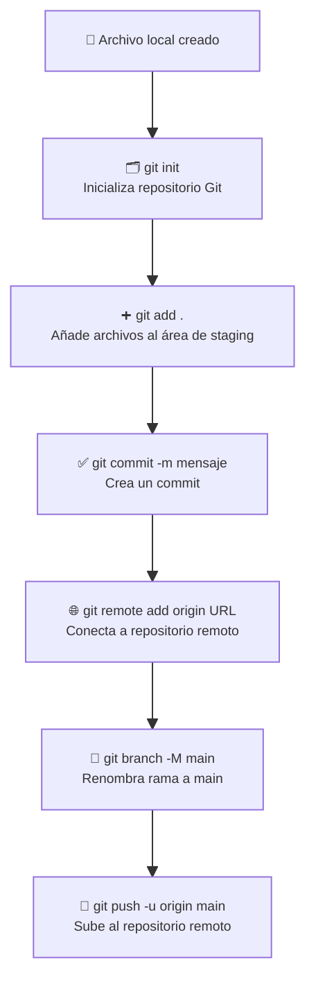

# 🧠 Comandos básicos de Git con explicación rápida

## 🛠️ Inicializar y configurar

- `git init`  
  👉 Inicializa un nuevo repositorio Git en el directorio actual.

- `git config --global user.name "Tu Nombre"`  
  👉 Configura tu nombre de usuario global para Git.

- `git config --global user.email "tuemail@ejemplo.com"`  
  👉 Configura tu email asociado a Git (necesario para los commits).

---

## 📁 Control de versiones

- `git status`  
  👉 Muestra el estado actual del repositorio (archivos modificados, sin seguimiento, etc.).

- `git add <archivo>`  
  👉 Añade un archivo al área de preparación (staging area).  
  Ej: `git add index.html`

- `git add .`  
  👉 Añade **todos** los archivos modificados al área de preparación.

- `git commit -m "Mensaje del commit"`  
  👉 Registra los cambios en el historial con un mensaje.

---

## 🔄 Conectar y subir a un repositorio remoto

- `git remote add origin <url-del-repo>`  
  👉 Conecta tu repositorio local con uno remoto (como GitHub).

- `git branch -M main`  
  👉 Renombra la rama actual a `main` (opcional pero común en GitHub).

- `git push -u origin main`  
  👉 Sube los cambios a la rama `main` del repositorio remoto por primera vez.

- `git push`  
  👉 Sube los nuevos commits al repositorio remoto.

---

## ⬇️ Descargar y trabajar desde un repositorio remoto

- `git clone <url-del-repo>`  
  👉 Clona (descarga) un repositorio remoto en tu máquina local.

---

🤝 Cómo añadir un colaborador a tu repositorio en GitHub
✅ Requisitos previos
Debes ser el propietario del repositorio o tener permisos de administrador.

El repositorio debe estar alojado en GitHub.

👣 Pasos para añadir un colaborador
1. Ir al repositorio en GitHub
Entra a https://github.com e inicia sesión.

Dirígete al repositorio donde quieres añadir un colaborador.

2. Entrar a la configuración del repositorio
Haz clic en la pestaña Settings (arriba a la derecha del repositorio).

Nota: Si no ves esta pestaña, probablemente no tienes los permisos adecuados.

3. Acceder a la sección de colaboradores
En el menú lateral izquierdo, selecciona Collaborators and teams (o solo Collaborators, si es un repositorio personal).

4. Invitar al colaborador
Haz clic en Invite a collaborator.

Escribe el nombre de usuario de GitHub de la persona que quieres invitar.

Selecciónalo en la lista desplegable y haz clic en Add o Send invitation.

La persona invitada debe aceptar la invitación desde su cuenta.

🕹️ Asignar permisos (rango) al colaborador
Una vez que el colaborador acepte la invitación, puedes asignarle un rol o permiso específico:

🔐 Niveles de permiso disponibles
Permiso	Descripción
Read	Solo puede ver el contenido del repositorio.
Triage	Puede gestionar issues y pull requests.
Write	Puede hacer commits, push y editar el contenido.
Maintain	Puede gestionar ramas, etiquetas, configuración y tareas comunes.
Admin	Tiene control total, incluyendo la gestión de colaboradores.

📌 ¿Cómo cambiar el permiso?
Vuelve a la sección Collaborators dentro de Settings.

Al lado del nombre del colaborador, haz clic en el ícono de lápiz ✏️.

Selecciona el nivel de acceso desde el menú desplegable.

# 🌿 Comandos de Git para trabajar con ramas

## 🔀 Crear y cambiar de rama

- `git branch`  
  👉 Lista todas las ramas locales del repositorio.

- `git branch <nombre-rama>`  
  👉 Crea una nueva rama con el nombre especificado.

- `git checkout <nombre-rama>`  
  👉 Cambia a la rama especificada.

- `git checkout -b <nombre-rama>`  
  👉 Crea una nueva rama y cambia a ella directamente.

## 🔁 Fusionar ramas (merge y rebase)

- `git merge <nombre-rama>`  
  👉 Fusiona la rama especificada con la rama actual. Crea un nuevo commit de merge si es necesario.

- `git rebase <nombre-rama>`  
  👉 Reaplica los commits de la rama actual encima de la rama especificada (reescribe el historial).

## ❌ Eliminar ramas

- `git branch -d <nombre-rama>`  
  👉 Elimina la rama especificada si ya ha sido fusionada.

- `git branch -D <nombre-rama>`  
  👉 Elimina la rama especificada forzadamente, aunque no esté fusionada.

## 📤 Subir y trabajar con ramas remotas

- `git push origin <nombre-rama>`  
  👉 Sube la rama local al repositorio remoto.

- `git push -u origin <nombre-rama>`  
  👉 Sube la rama al remoto y la vincula para futuros `git push` y `git pull`.

- `git fetch`  
  👉 Descarga los cambios del repositorio remoto sin fusionarlos.

- `git pull`  
  👉 Descarga y fusiona los cambios del remoto a tu rama actual.

## 📥 Ramas remotas

- `git branch -r`  
  👉 Muestra las ramas remotas disponibles.

- `git checkout -t origin/<nombre-rama>`  
  👉 Crea una nueva rama local rastreando una rama remota.

